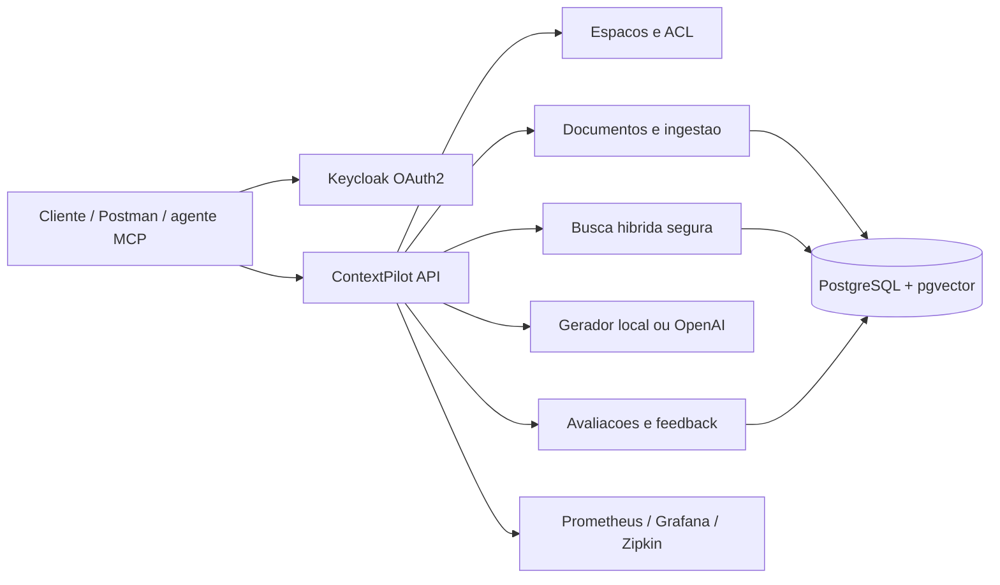

# ContextPilot

Plataforma Java para transformar documentos corporativos em respostas rastreaveis, sem ignorar quem pode acessar cada informacao. O ContextPilot combina RAG, busca hibrida, citacoes verificaveis, permissoes por documento, avaliacoes automatizadas e ferramentas MCP em uma unica aplicacao executavel.

[](https://openjdk.org/projects/jdk/21/)
[](https://spring.io/projects/spring-boot)
[](https://spring.io/projects/spring-ai)
[](https://github.com/Mateusmith/contextpilot/actions/workflows/ci.yml)
[](LICENSE)

## Problema resolvido

Um chatbot corporativo simples pode recuperar um trecho que o usuario nao deveria ver, inventar uma resposta sem evidencia ou piorar silenciosamente depois de uma mudanca. O ContextPilot trata esses riscos como regras de negocio:

- a ACL entra na consulta SQL antes da recuperacao, evitando vazamento por pos-filtragem;
- toda afirmacao entregue precisa apontar para marcadores como `[F1]`;
- citacoes desconhecidas ou ausentes transformam a saida em recusa segura;
- documentos sao deduplicados, versionados e processados por uma fila concorrente;
- conjuntos de avaliacao medem termos, fontes e recusas esperadas;
- auditoria registra alteracoes de acesso e consultas sem armazenar tokens;
- o modo local permite demonstrar o projeto sem chave paga.

## Arquitetura



O projeto e um monolito modular orientado por capacidades. JDBC explicito deixa visiveis as transacoes, o bloqueio `FOR UPDATE SKIP LOCKED` e a consulta de busca que incorpora a autorizacao. Mais detalhes estao em [ARCHITECTURE.md](docs/ARCHITECTURE.md) e [THREAT-MODEL.md](docs/THREAT-MODEL.md).

## Fluxo RAG

1. Um proprietario cria o espaco e adiciona curadores ou leitores.
2. Um PDF, TXT ou Markdown e validado, identificado por SHA-256 e salvo como `PENDENTE`.
3. Um trabalhador reivindica a tarefa sem bloquear outros trabalhadores, extrai o texto, cria trechos sobrepostos e gera embeddings.
4. A pergunta gera um embedding e executa busca semantica + busca textual em portugues.
5. O SQL considera apenas documentos `PRONTO` que o usuario pode ler.
6. O gerador recebe fontes marcadas e trata seu conteudo como dado nao confiavel.
7. A resposta e validada; somente fontes realmente citadas sao persistidas e devolvidas.
8. Metricas, feedback, citacoes e auditoria permitem acompanhar o comportamento.

## Tecnologias

- Java 21, Spring Boot 4.1, Spring Security 7 e Spring AI 2.0 MCP
- PostgreSQL 17, `pgvector`, Flyway e Spring JDBC
- OAuth2/OIDC com Keycloak e Swagger com Authorization Code + PKCE
- OpenAI Responses API e Embeddings API como adaptadores opcionais
- PDFBox para extracao de PDF
- Micrometer, Prometheus, Grafana, OpenTelemetry e Zipkin
- JUnit, MockMvc e Testcontainers com PostgreSQL/pgvector real
- Docker Compose, Postman/Newman e GitHub Actions

## Inicio rapido

### Requisitos

- Docker Desktop com Compose
- Portas livres: `8083`, `54326`, `18084`, `19411`, `19093` e `13003`

### Subir a plataforma

```powershell
git clone https://github.com/Mateusmith/contextpilot.git
cd contextpilot
Copy-Item .env.example .env
docker compose --profile observability up -d --build
docker compose ps
```

Espere o servico `aplicacao` ficar `healthy`. A primeira construcao baixa as dependencias Maven.

| Recurso | Endereco | Acesso local |
|---|---|---|
| API | http://localhost:8083 | token OAuth2 |
| Swagger | http://localhost:8083/swagger-ui.html | `contextpilot-swagger` + PKCE |
| Keycloak | http://localhost:18084 | `admin` / `admin` |
| Grafana | http://localhost:13003 | `admin` / `admin_contextpilot` |
| Prometheus | http://localhost:19093 | rede local Docker |
| Zipkin | http://localhost:19411 | local |
| PostgreSQL | `localhost:54326/contextpilot` | `contextpilot` / `contextpilot_local` |

Usuarios de demonstracao no realm `contextpilot`:

| Usuario | Senha | Papel criado durante o fluxo |
|---|---|---|
| `ana` | `context123` | proprietaria |
| `bruno` | `context123` | curador |
| `carla` | `context123` | leitora |

As credenciais existem apenas para desenvolvimento. Altere o arquivo `.env` e o realm em qualquer ambiente compartilhado.

### Executar a carga automatizada

```powershell
./scripts/smoke-test.ps1
```

O script prova o bloqueio de um documento restrito, concede acesso, exige uma resposta com fonte, registra feedback, executa uma avaliacao, consulta auditoria/metricas e descobre as ferramentas MCP.

## Postman

Importe os dois arquivos:

- [colecao](postman/ContextPilot.postman_collection.json)
- [ambiente local](postman/ContextPilot.postman_environment.json)

Defina `document_file` com o caminho absoluto de [politica-reembolso.md](postman/politica-reembolso.md) e execute as pastas na ordem. A colecao salva tokens e identificadores automaticamente e contem assercoes de ACL, citacao, avaliacao e descoberta MCP.

## Exemplos da API

Obtenha um token:

```bash
curl -X POST http://localhost:18084/realms/contextpilot/protocol/openid-connect/token \
  -H "Content-Type: application/x-www-form-urlencoded" \
  -d "grant_type=password&client_id=contextpilot-postman&username=ana&password=context123"
```

Crie um espaco:

```http
POST /api/v1/espacos
Authorization: Bearer <token>
Content-Type: application/json

{
  "nome": "Operacoes Financeiras",
  "descricao": "Politicas internas do atendimento"
}
```

Adicione um membro:

```json
{
  "usuarioId": "carla",
  "papel": "LEITOR"
}
```

Envie um documento:

```bash
curl -X POST "http://localhost:8083/api/v1/espacos/<espacoId>/documentos" \
  -H "Authorization: Bearer <token>" \
  -F "titulo=Politica de reembolso" \
  -F "visibilidade=RESTRITO" \
  -F "arquivo=@postman/politica-reembolso.md"
```

Conceda acesso ao documento:

```json
{
  "usuarioId": "carla",
  "nivel": "LEITURA"
}
```

Pergunte com RAG:

```http
POST /api/v1/espacos/<espacoId>/consultas
Authorization: Bearer <token-carla>
Content-Type: application/json

{
  "pergunta": "Qual e o prazo para solicitar reembolso?"
}
```

Resposta resumida:

```json
{
  "consultaId": "c3acb68e-bbd5-46a9-b118-522bcf414469",
  "resposta": "Com base no conhecimento disponivel: O prazo para solicitar reembolso e de 30 dias apos a data da compra. [F1]",
  "recusada": false,
  "provedorIa": "local-extrativo-v1",
  "fontes": [
    {
      "marcador": "F1",
      "documentoId": "49af3282-03db-4f84-ae75-70d89109aa68",
      "tituloDocumento": "Politica de reembolso",
      "ordemTrecho": 0,
      "pontuacao": 0.82
    }
  ]
}
```

Crie um caso de avaliacao:

```json
{
  "pergunta": "Qual e o prazo para solicitar reembolso?",
  "termosEsperados": ["30 dias"],
  "documentosEsperados": ["<documentoId>"],
  "deveRecusar": false
}
```

## Provedores de IA

O padrao e `local`. Ele usa embeddings por hashing e um gerador extrativo deterministico. Isso e intencional para testes, demonstracoes offline e CI; ele nao finge ser um LLM.

Para usar OpenAI:

```dotenv
CONTEXT_PILOT_PROVEDOR_IA=openai
OPENAI_API_KEY=sk-...
CONTEXT_PILOT_MODELO_CHAT=gpt-5-mini
CONTEXT_PILOT_MODELO_EMBEDDING=text-embedding-3-small
```

O adaptador usa a Responses API com `store=false`, limita a saida e valida os marcadores devolvidos. Os embeddings sao solicitados com 384 dimensoes para manter um unico indice. Consulte a [documentacao da Responses API](https://developers.openai.com/api/docs/guides/migrate-to-responses) e de [embeddings](https://developers.openai.com/api/docs/guides/embeddings).

> Trocar o provedor depois de indexar documentos exige reindexacao completa, pois vetores de modelos diferentes nao devem compartilhar o mesmo espaco vetorial.

## MCP

O servidor MCP stateless fica em `/mcp` e exige o mesmo Bearer Token da API. Ele expoe apenas ferramentas que reaplicam a ACL:

- `listarDocumentos`
- `buscarConhecimento`
- `consultarComFontes`

As ferramentas nao permitem upload nem mudanca de permissao. Esse limite reduz o impacto de prompt injection e de clientes MCP comprometidos.

## Testes

```powershell
$env:JAVA_HOME='C:\Program Files\Java\jdk-21'
./mvnw verify
```

A suite usa uma imagem real `pgvector/pgvector:pg17`. Entre os cenarios cobertos:

- embeddings deterministas e normalizados;
- fragmentacao e sobreposicao;
- geracao extrativa com citacao e recusa;
- migracao Flyway e extensao `vector`;
- API e metricas protegidas por credenciais diferentes;
- documento restrito invisivel antes da permissao;
- RAG citado depois da permissao;
- feedback, avaliacao e trilha de auditoria.

## Decisoes e limites

- O binario original fica em `BYTEA` para manter uma demonstracao autocontida. O contrato do modulo permite migrar para armazenamento S3 sem alterar o RAG.
- A fila no PostgreSQL e adequada ao monolito e usa `SKIP LOCKED`. Kafka seria custo operacional sem beneficio neste escopo.
- A autorizacao e repetida no SQL de busca, nao aplicada depois do `LIMIT`.
- O projeto nao fornece uma interface web; Swagger, Postman, MCP e a API sao os clientes intencionais.
- Para producao, use TLS, um gerenciador de segredos, backup, politicas de retencao e Keycloak fora do modo `start-dev`.

## Documentacao

- [Arquitetura](docs/ARCHITECTURE.md)
- [Modelo de ameacas](docs/THREAT-MODEL.md)
- [ADR 001: monolito modular](docs/adr/001-modular-monolith.md)
- [ADR 002: ACL dentro da recuperacao](docs/adr/002-retrieval-authorization.md)
- [ADR 003: modo de IA intercambiavel](docs/adr/003-ai-providers.md)
- [Politica de seguranca](SECURITY.md)
- [Como contribuir](CONTRIBUTING.md)
- [Historico de versoes](CHANGELOG.md)

## Licenca

Distribuido sob a [licenca MIT](LICENSE).
