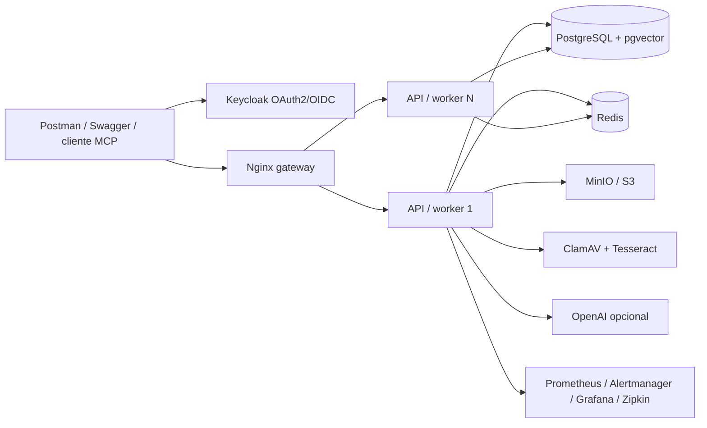

# Assistente de Conhecimento

API Java para transformar documentos corporativos em respostas rastreaveis sem
ultrapassar a permissao de quem pergunta. O projeto demonstra RAG seguro, busca
avancada, ingestao de arquivos, governanca multi-tenant e operacao distribuida em um
sistema executavel, nao em um prototipo isolado.

[](https://openjdk.org/projects/jdk/21/)
[](https://spring.io/projects/spring-boot)
[](https://github.com/Mateusmith/assistente-conhecimento/actions/workflows/ci.yml)
[](LICENSE)

## Problema resolvido

Um chatbot corporativo comum pode recuperar um documento proibido, obedecer a uma
instrucao escondida no arquivo, inventar uma fonte ou ficar indisponivel durante a
troca do modelo de embeddings. O Assistente de Conhecimento trata esses riscos como
regras de negocio:

- tenant e ACL entram no SQL antes da ordenacao e do `LIMIT`;
- cada afirmacao precisa citar uma fonte valida como `[F1]`;
- trechos suspeitos de prompt injection nao entram no contexto;
- documentos passam por ClamAV, MinIO/S3, SHA-256 e OCR real;
- indices de embedding sao construidos blue-green e permitem rollback;
- busca aceita metadados e compara estrategias hibrida, semantica e textual;
- conversas preservam contexto sem compartilhar memoria entre usuarios;
- streaming envia somente fontes e resposta ja validadas, nunca tokens crus;
- avaliacao mede recall, precisao, MRR, p95 e custo contra uma baseline;
- Redis aplica limites e quotas compartilhados entre replicas;
- tokens, custos, SLOs, alertas e tempo de ingestao sao observaveis;
- exportacao, exclusao, pseudonimizacao e retencao apoiam operacoes LGPD;
- testes adversariais bloqueiam regressao de isolamento e citacoes.

## Arquitetura resumida



O projeto e um monolito modular. JDBC explicito torna visiveis as transacoes, leases,
`UPSERT`, `FOR UPDATE SKIP LOCKED` e a autorizacao dentro da recuperacao. Consulte
[Arquitetura](docs/ARCHITECTURE.md) e [Modelo de ameacas](docs/THREAT-MODEL.md).

## Tecnologias

- Java 21, virtual threads, Spring Boot 4.1, Spring Security 7 e Spring AI MCP 2.0
- PostgreSQL 17, pgvector, Flyway e Spring JDBC
- Redis com script Lua atomico para limites distribuidos
- MinIO/S3, AWS SDK, ClamAV, PDFBox e Tesseract `por+eng`
- OAuth2/OIDC, JWT com audiencia, Keycloak, Swagger PKCE e SSE
- Prometheus, Alertmanager, Grafana, OpenTelemetry e Zipkin
- JUnit 5, MockMvc, Testcontainers, JaCoCo, Postman e Newman
- Docker Compose, Nginx, GitHub Actions e configtree para segredos

## Inicio rapido

### Requisitos

- Docker Desktop com Compose
- PowerShell 7 para a carga automatizada
- portas livres: `8083`, `54326`, `16383`, `18084`, `19000`, `19001`,
  `13310`, `19411`, `19093`, `19094` e `13003`

### Subir tudo

```powershell
git clone https://github.com/Mateusmith/assistente-conhecimento.git
cd assistente-conhecimento
Copy-Item .env.example .env
docker compose --profile observability up -d --build
docker compose ps
```

Espere `aplicacao` e `gateway` ficarem `healthy`.

| Recurso | Endereco | Acesso local |
|---|---|---|
| API | http://localhost:8083 | Bearer Token |
| Swagger | http://localhost:8083/swagger-ui.html | `contextpilot-swagger` + PKCE |
| Keycloak | http://localhost:18084 | `admin` / `admin` |
| PostgreSQL | `localhost:54326/contextpilot` | `contextpilot` / `contextpilot_local` |
| Redis | `localhost:16383` | rede local |
| MinIO Console | http://localhost:19001 | `contextpilot` / `contextpilot_storage_local` |
| Prometheus | http://localhost:19093 | local |
| Alertmanager | http://localhost:19094 | local |
| Grafana | http://localhost:13003 | `admin` / `admin_contextpilot` |
| Zipkin | http://localhost:19411 | local |

Usuarios de demonstracao:

| Usuario | Senha | Uso no fluxo |
|---|---|---|
| `ana` | `context123` | proprietaria |
| `bruno` | `context123` | curador |
| `carla` | `context123` | leitora |

Essas credenciais sao apenas locais.

### Carga de ponta a ponta

```powershell
./scripts/smoke-test.ps1
```

O script executa 23 etapas e prova ClamAV, S3, integridade, OCR, ACL, citacoes,
conversa idempotente, streaming validado, avaliacao quantitativa, MCP, comparacao de
busca, governanca, reindexacao blue-green, rollback e exportacao LGPD.

## Postman

Importe:

- [colecao](postman/AssistenteConhecimento.postman_collection.json)
- [ambiente local](postman/AssistenteConhecimento.postman_environment.json)

Execute as pastas em ordem. Tokens e IDs sao capturados automaticamente. No Postman
Desktop, ajuste `document_file` para o caminho absoluto de
[politica-reembolso.md](postman/politica-reembolso.md) caso o cliente nao resolva o
caminho relativo. Pelo terminal, a colecao completa pode ser comprovada a partir da
raiz do projeto:

```powershell
npx --yes newman run postman/AssistenteConhecimento.postman_collection.json `
  -e postman/AssistenteConhecimento.postman_environment.json
```

A colecao possui assercoes de ACL, fontes, conversas, idempotencia, armazenamento,
avaliacao, MCP, reindexacao, uso e privacidade.

## Exemplos da API

### Token

```bash
curl -X POST http://localhost:18084/realms/contextpilot/protocol/openid-connect/token \
  -H "Content-Type: application/x-www-form-urlencoded" \
  -d "grant_type=password&client_id=contextpilot-postman&username=ana&password=context123"
```

### Espaco e membro

```http
POST /api/v1/espacos
Authorization: Bearer <token-ana>
Content-Type: application/json

{
  "nome": "Operacoes Financeiras",
  "descricao": "Politicas internas do atendimento"
}
```

```http
POST /api/v1/espacos/{espacoId}/membros
Authorization: Bearer <token-ana>
Content-Type: application/json

{
  "usuarioId": "carla",
  "papel": "LEITOR"
}
```

### Upload com metadados

```bash
curl -X POST "http://localhost:8083/api/v1/espacos/<espacoId>/documentos" \
  -H "Authorization: Bearer <token-ana>" \
  -F "titulo=Politica de reembolso" \
  -F "visibilidade=RESTRITO" \
  -F 'metadados={"departamento":"financeiro","tags":["reembolso","politica"]}' \
  -F "arquivo=@postman/politica-reembolso.md"
```

Metadados aceitam ate 20 chaves e valores escalares ou listas curtas de texto.

### Permissao e pergunta filtrada

```http
POST /api/v1/espacos/{espacoId}/documentos/{documentoId}/permissoes
Authorization: Bearer <token-ana>
Content-Type: application/json

{
  "usuarioId": "carla",
  "nivel": "LEITURA"
}
```

```http
POST /api/v1/espacos/{espacoId}/consultas
Authorization: Bearer <token-carla>
Content-Type: application/json

{
  "pergunta": "Qual e o prazo para solicitar reembolso?",
  "estrategia": "HIBRIDA",
  "filtros": {
    "metadados": {"departamento": "financeiro"},
    "tags": ["reembolso"],
    "tipoMime": "text/markdown"
  }
}
```

`estrategia` aceita `HIBRIDA`, `SEMANTICA` ou `TEXTUAL`. Os filtros opcionais tambem
aceitam `documentos`, `criadoDe` e `criadoAte` em ISO-8601.

Resposta resumida:

```json
{
  "consultaId": "c3acb68e-bbd5-46a9-b118-522bcf414469",
  "resposta": "Com base no conhecimento disponivel: O prazo e de 30 dias. [F1]",
  "recusada": false,
  "provedorIa": "local-extrativo-v1",
  "modeloEmbedding": "local-hashing-v1",
  "estrategiaBusca": "HIBRIDA",
  "tokensEntrada": 0,
  "tokensSaida": 0,
  "custoEstimadoUsd": 0,
  "fontes": [
    {
      "marcador": "F1",
      "documentoId": "49af3282-03db-4f84-ae75-70d89109aa68",
      "tituloDocumento": "Politica de reembolso",
      "ordemTrecho": 0,
      "pontuacao": 0.82
    }
  ]
}
```

### Comparar estrategias

```http
POST /api/v1/espacos/{espacoId}/buscas/comparacoes
Authorization: Bearer <token-carla>
Content-Type: application/json

{
  "pergunta": "prazo para reembolso",
  "filtros": {"tags": ["reembolso"]}
}
```

A resposta mostra os resultados de cada estrategia e a sobreposicao entre semantica e
textual. Isso permite medir uma mudanca antes de alterar o padrao.

### Conversa com memoria segura

```http
POST /api/v1/espacos/{espacoId}/conversas
Authorization: Bearer <token-carla>
Content-Type: application/json

{"titulo":"Duvidas sobre reembolso"}
```

```http
POST /api/v1/espacos/{espacoId}/conversas/{conversaId}/mensagens
Authorization: Bearer <token-carla>
Idempotency-Key: reembolso-001
Content-Type: application/json

{"pergunta":"Qual e o prazo para solicitar reembolso?"}
```

Uma continuacao como `E quais dados preciso enviar?` usa a janela de memoria apenas
para contextualizar busca e pergunta. Todas as afirmacoes continuam dependentes das
fontes autorizadas da nova interacao. Repetir a mesma chave e o mesmo corpo devolve a
consulta anterior; reutilizar a chave com outro corpo retorna `409`.

Para progresso por SSE, envie o mesmo corpo para
`POST .../mensagens/stream` com `Accept: text/event-stream`. Os eventos sao `etapa`,
`fontes`, `resposta` e `concluido`; a resposta so aparece depois da validacao.

### Avaliacao RAG 2.0

```json
{
  "pergunta": "Qual e o prazo para reembolso?",
  "termosEsperados": ["30 dias"],
  "documentosEsperados": ["<documentoId>"],
  "deveRecusar": false,
  "latenciaMaximaMs": 2000,
  "custoMaximoUsd": 0.01
}
```

Cada execucao registra cobertura de termos, recall, precisao, MRR, p95, custo, modelo
e provedor. Compare uma mudanca com a baseline em:

```http
GET /api/v1/espacos/{espacoId}/avaliacoes/{conjuntoId}/execucoes/{atualId}/comparacoes/{baseId}
Authorization: Bearer <token-ana>
```

## Reindexacao sem parada

Modelos habilitados:

```http
GET /api/v1/espacos/{espacoId}/indices-embedding/modelos
Authorization: Bearer <token-ana>
```

Iniciar a versao local v2:

```http
POST /api/v1/espacos/{espacoId}/indices-embedding
Authorization: Bearer <token-ana>
Content-Type: application/json

{"modelo":"local-hashing-v2"}
```

O estado progride de `CONSTRUINDO` para `ATIVO`. O indice anterior vira `ARQUIVADO`.
Rollback:

```http
POST /api/v1/espacos/{espacoId}/indices-embedding/{indiceAnteriorId}/ativacao
Authorization: Bearer <token-ana>
```

Somente o proprietario opera indices. Uma construcao incompleta ou falha nunca assume
consultas.

## Governanca e LGPD

```http
PUT /api/v1/espacos/{espacoId}/governanca
Authorization: Bearer <token-ana>
Content-Type: application/json

{
  "limiteArmazenamentoBytes": 1073741824,
  "limiteConsultasDia": 1000,
  "limiteUploadsDia": 100,
  "retencaoConsultasDias": 365
}
```

```http
GET /api/v1/espacos/{espacoId}/governanca/uso
Authorization: Bearer <token-ana>
```

Uso inclui bytes, consultas, uploads, tokens e custo estimado dos ultimos 30 dias.
Respostas `429` incluem `Retry-After`, `X-RateLimit-Limit` e
`X-RateLimit-Remaining`.

```http
GET /api/v1/privacidade/exportacao
Authorization: Bearer <token>
```

```http
DELETE /api/v1/privacidade/meus-dados?confirmar=true
Authorization: Bearer <token>
```

A exclusao apaga conversas, consultas e vinculos, pseudonimiza autoria/auditoria e recusa operar
enquanto o usuario for proprietario de um espaco. A exportacao inclui espacos,
documentos, consultas, conversas, mensagens, feedbacks e eventos pessoais de auditoria.

## Provedores e custo

O modo padrao `local` possui dois embeddings deterministas e geracao extrativa. Ele e
reprodutivel, offline e nao se apresenta como LLM.

Para OpenAI:

```dotenv
CONTEXT_PILOT_PROVEDOR_IA=openai
OPENAI_API_KEY=sk-...
CONTEXT_PILOT_MODELO_CHAT=gpt-5-mini
CONTEXT_PILOT_MODELO_EMBEDDING=text-embedding-3-small
AI_CHAT_INPUT_COST_PER_MILLION=0
AI_CHAT_OUTPUT_COST_PER_MILLION=0
AI_EMBEDDING_COST_PER_MILLION=0
```

Preencha os tres custos conforme o contrato vigente. O projeto mantem zero por padrao
para nao transformar preco antigo em telemetria enganosa. Tokens reais retornados pelo
provedor continuam contabilizados.

## Escala horizontal

O gateway evita conflito de portas e os workers usam leases retomaveis:

```powershell
docker compose -f compose.yml -f compose.scale.yml --profile observability up -d --build
docker compose -f compose.yml -f compose.scale.yml ps
```

O overlay inicia tres replicas. PostgreSQL, Redis e MinIO sao compartilhados. Nao use
`container_name`, pois ele impede replicas.

## Seguranca de producao

O Spring importa `/run/secrets` por configtree. Veja
[docker/secrets/README.md](docker/secrets/README.md) e
[compose.production.example.yml](compose.production.example.yml). O perfil `prod`
interrompe o boot se detectar credencial curta/de demonstracao, identidade sem HTTPS ou
TLS sem terminacao confiavel. O exemplo termina TLS 1.2/1.3 no Nginx, encaminha o protocolo
ao Spring e desativa Swagger em producao.

Antes de usar o overlay, disponibilize `tls.crt` e `tls.key` em `TLS_DIRECTORY`, os
segredos descritos na documentacao e informe `JWT_ISSUER_URI`, `JWT_JWK_SET_URI` e
`CORS_ALLOWED_ORIGINS`. Valide a composicao antes da implantacao:

```powershell
docker compose -f compose.yml -f compose.production.example.yml config --quiet
```

Controles adicionais:

- HSTS em HTTPS, CSP, `no-store`, `Referrer-Policy` e `Permissions-Policy`;
- CORS por lista de origens;
- tokens exigem assinatura, emissor, validade e audiencia `contextpilot-api`;
- ClamAV fail-closed e verificacao SHA-256;
- nenhuma pergunta, resposta ou token em labels de metrica;
- benchmark adversarial publicado pelo CI.

## Observabilidade

O dashboard provisionado cobre disponibilidade, p95, fila, leases, ingestao, OCR,
antivirus, armazenamento, reindexacao, conversas, quotas, tokens e custo. Prometheus carrega
[regras de SLO e alerta](docker/prometheus/rules.yml), e cada alerta aponta para
[runbooks](docs/runbooks).

## Testes

```powershell
./mvnw clean verify
```

A suite usa PostgreSQL/pgvector e MinIO reais via Testcontainers e cobre:

- migracoes Flyway e retrocompatibilidade de `BYTEA` legado;
- S3, hash, ClamAV, OCR, fragmentacao e embeddings;
- API, metricas, OAuth2, tenant e ACL de documento;
- metadados, tres estrategias e filtro cross-tenant;
- reindexacao v1 para v2 e rollback;
- prompt injection, citacao falsa, cross-tenant e documento sem permissao;
- memoria conversacional isolada, lease, idempotencia, SSE validado e audiencia JWT;
- recall, precisao, MRR, orcamento e comparacao de execucoes RAG;
- quotas, uso, exportacao e exclusao LGPD.

O relatorio adversarial fica em `target/adversarial-report.json`; cobertura JaCoCo em
`target/site/jacoco`.

## Documentacao

- [Arquitetura](docs/ARCHITECTURE.md)
- [Matriz de capacidades de IA](docs/AI-CAPABILITY-MATRIX.md)
- [Modelo de ameacas](docs/THREAT-MODEL.md)
- [ADR 001: monolito modular](docs/adr/001-modular-monolith.md)
- [ADR 002: ACL dentro da recuperacao](docs/adr/002-retrieval-authorization.md)
- [ADR 003: provedores de IA](docs/adr/003-ai-providers.md)
- [ADR 004: ingestao segura](docs/adr/004-secure-document-ingestion.md)
- [ADR 005: indices blue-green](docs/adr/005-blue-green-embedding-indexes.md)
- [ADR 006: governanca distribuida](docs/adr/006-distributed-governance.md)
- [ADR 007: memoria conversacional segura](docs/adr/007-secure-conversational-memory.md)
- [ADR 008: avaliacao RAG quantitativa](docs/adr/008-rag-evaluation-regression.md)
- [Politica de seguranca](SECURITY.md)
- [Como contribuir](CONTRIBUTING.md)
- [Historico](CHANGELOG.md)

## Licenca

Distribuido sob a [licenca MIT](LICENSE).
