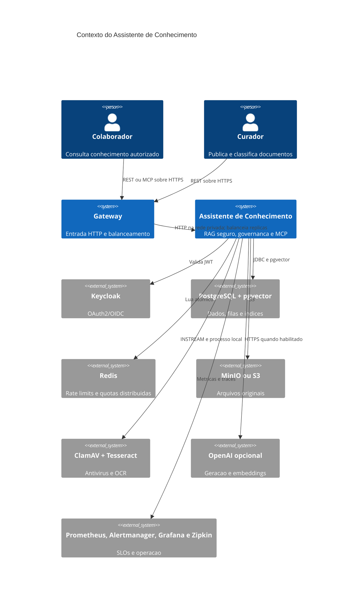
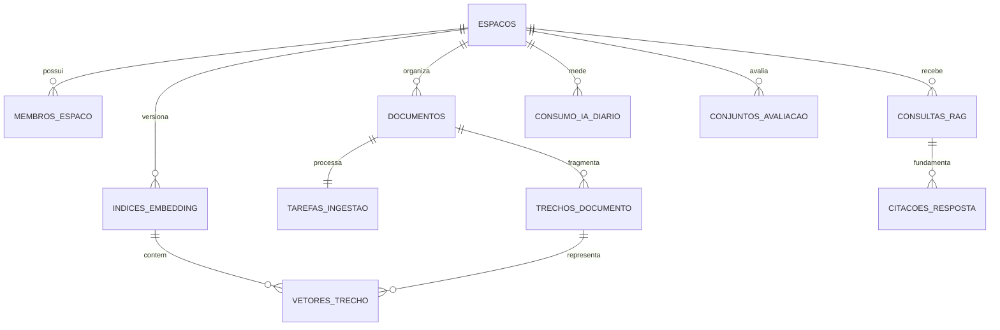
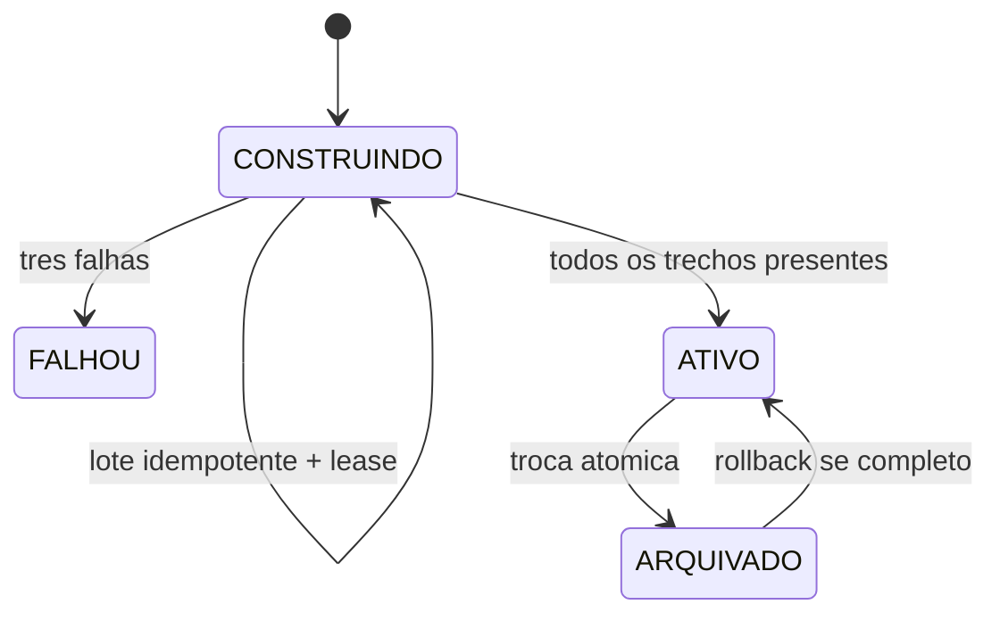

# Arquitetura do Assistente de Conhecimento

## Contexto

O sistema transforma documentos privados em respostas verificaveis. Autorizacao,
qualidade e custo fazem parte do dominio: uma busca nao pode ranquear informacao de
outro tenant, uma resposta sem fonte deve ser recusada e uma troca de modelo nao pode
interromper consultas.

## Modulos

| Pacote | Responsabilidade |
|---|---|
| `workspace` | espacos, membros, papeis e acesso |
| `document` | upload, metadados, antivirus, S3, OCR, fila e deteccao de prompt injection |
| `reindex` | catalogo, construcao em lotes, lease, ativacao e rollback de indices |
| `retrieval` | filtros, ACL, busca hibrida/semantica/textual e reranking |
| `answer` | geracao, citacoes, recusa segura, historico e feedback |
| `governance` | rate limiting, quotas, armazenamento, tokens e custos |
| `privacy` | exportacao, pseudonimizacao, exclusao e retencao LGPD |
| `evaluation` | casos e execucoes de regressao RAG |
| `mcp` | ferramentas autenticadas e somente de consulta |
| `audit` | trilha das operacoes relevantes |
| `observability` | gauges operacionais, SLOs e alertas |

## Dados principais

## Recuperacao segura

1. O indice `ATIVO` define o modelo e o espaco vetorial da consulta.
2. Metadados, datas, MIME, tenant, membros e ACL entram no SQL antes do `LIMIT`.
3. Trechos suspeitos de prompt injection nao entram no contexto.
4. A estrategia calcula score hibrido, semantico ou textual.
5. Um reranker deterministico considera cobertura da pergunta e titulo.
6. O gerador recebe apenas fontes autorizadas e marcadas.
7. Marcadores ausentes ou inventados produzem recusa segura.

## Reindexacao blue-green

O indice anterior continua atendendo enquanto o novo e construido. Trabalhadores
inserem vetores com chave unica `(indice_id, trecho_id)`, portanto uma retomada nao
duplica trabalho. A ativacao bloqueia a linha do espaco, reconta trechos e troca os
estados na mesma transacao.

## Concorrencia e escala

- ingestao e reindexacao usam `FOR UPDATE SKIP LOCKED`;
- leases vencidos sao retomados por outra instancia;
- Redis executa um script Lua atomico para limites compartilhados;
- binarios ficam no S3/MinIO e nao no heap nem no PostgreSQL;
- Nginx resolve o servico Docker e distribui requisicoes entre replicas;
- `docker compose -f compose.yml -f compose.scale.yml up -d --build` inicia tres replicas.

## Consistencia

- ClamAV aprova antes da persistencia e falha fechado;
- rollback do banco remove o objeto S3 por compensacao;
- SHA-256 e verificado a cada leitura;
- registro do documento e tarefa pertencem a uma transacao;
- trechos, vetores do indice ativo e conclusao da tarefa sao atomicos;
- respostas e citacoes sao persistidas juntas;
- retencao remove consultas e preserva resultados de avaliacao com referencia nula;
- documentos V1 em `BYTEA` continuam legiveis.

## Operacao

Prometheus calcula disponibilidade e p95, enquanto alertas cobrem API indisponivel,
erros, latencia, fila parada, lease expirado, reindexacao falha e qualidade abaixo de
80%. Cada alerta aponta para um runbook em `docs/runbooks`. Tokens e custos sao
agregados por espaco e dia; valores unitarios sao configuraveis para evitar apresentar
uma estimativa desatualizada como cobranca real.
