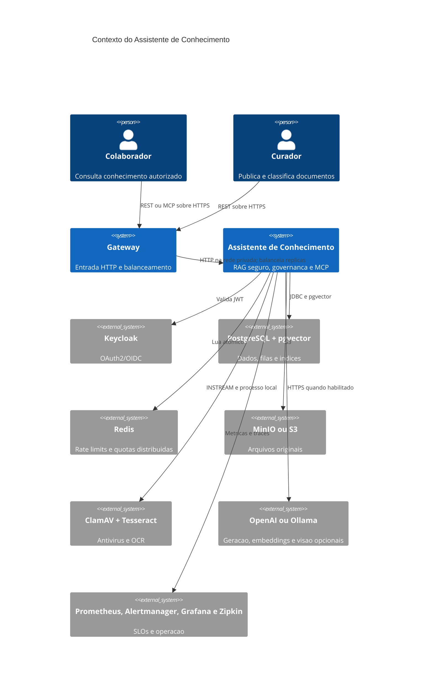
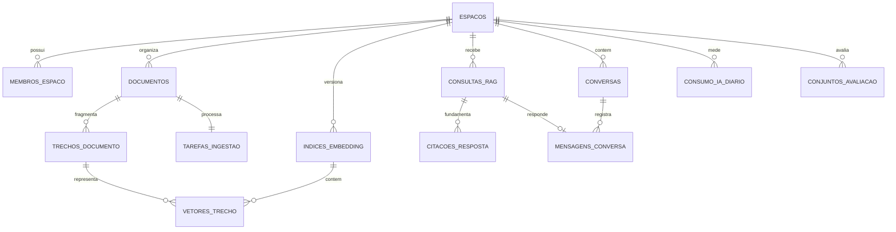
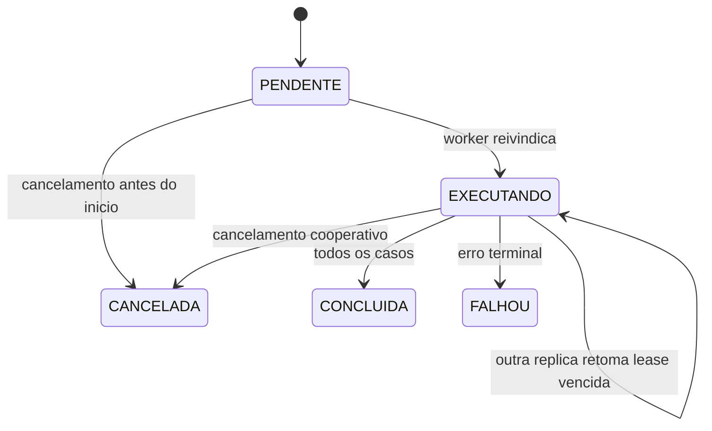
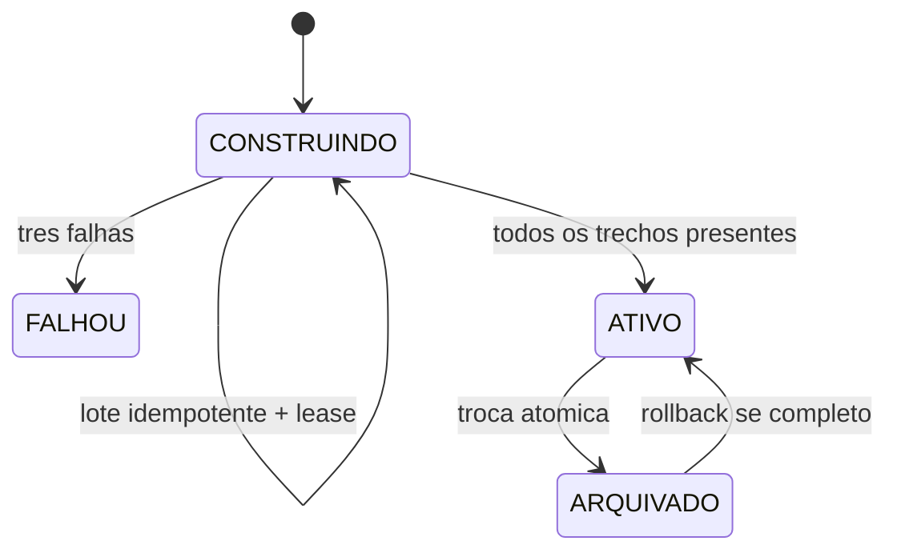

# Arquitetura do Assistente de Conhecimento

## Contexto

O sistema transforma documentos privados em respostas verificaveis. Autorizacao,
qualidade e custo fazem parte do dominio: uma busca nao pode ranquear informacao de
outro tenant, uma resposta sem fonte deve ser recusada e uma troca de modelo nao pode
interromper consultas.

## Modulos

| Pacote | Responsabilidade |
|---|---|
| `workspace` | espacos, membros, papeis e acesso |
| `document` | upload, metadados, antivirus, S3, OCR, visao, fila e deteccao de prompt injection |
| `reindex` | catalogo, construcao em lotes, lease, ativacao e rollback de indices |
| `retrieval` | filtros, ACL, busca hibrida/semantica/textual, MMR e contexto vizinho |
| `answer` | geracao, proveniencia do prompt, citacoes, recusa segura e feedback |
| `conversation` | memoria privada, idempotencia, lease e streaming SSE validado |
| `governance` | rate limiting, quotas, armazenamento, tokens e custos |
| `privacy` | protecao antes da IA externa, exportacao, pseudonimizacao, exclusao e retencao LGPD |
| `evaluation` | jobs retomaveis, casos, metricas de recuperacao e regressao RAG |
| `mcp` | ferramentas autenticadas e somente de consulta |
| `audit` | trilha das operacoes relevantes |
| `observability` | gauges operacionais, SLOs e alertas |

## Dados principais

## Recuperacao segura

1. O indice `ATIVO` define o modelo e o espaco vetorial da consulta.
2. Metadados, datas, MIME, tenant, membros e ACL entram no SQL antes do `LIMIT`.
3. Trechos suspeitos de prompt injection nao entram no contexto.
4. A estrategia calcula score hibrido, semantico ou textual.
5. Um reranker deterministico considera cobertura da pergunta e titulo.
6. MMR escolhe ancoras relevantes sem repetir o mesmo conteudo.
7. Trechos vizinhos expandem a explicacao; o SQL reaplica indice, tenant, membro, ACL,
   documento pronto e risco de prompt.
8. Antes de um provedor externo, identificadores reconhecidos viram marcadores locais.
9. O gerador recebe apenas fontes autorizadas e marcadas; a API restaura os valores.
10. Marcadores de citacao ausentes ou inventados produzem recusa segura.

Cada consulta persiste indice, modelo, estrategia, candidatos, fontes enviadas, versao
e SHA-256 do prompt e quantidade de valores protegidos. O hash prova qual template foi
usado sem armazenar uma segunda copia do prompt nem expor raciocinio interno.

## Conversas e streaming seguro

1. A conversa e localizada por `espaco_id`, `usuario_id` e `id`; outro membro recebe `404`.
2. Uma lease atomica serializa geracoes na mesma conversa e expira para permitir retomada.
3. As ultimas mensagens ajudam a compor a busca, mas nao entram na lista de fontes.
4. Pergunta, estrategia e filtros formam uma impressao SHA-256 associada ao
   `Idempotency-Key`.
5. Usuario e assistente sao persistidos em sequencia na mesma transacao.
6. O SSE transmite fontes e resposta apenas depois da validacao de citacoes.

## Avaliacao RAG

Casos registram ground truth de termos e documentos e podem impor limites de latencia
e custo. O `POST` apenas agenda o job e responde `202`. Workers reivindicam uma
execucao com `FOR UPDATE SKIP LOCKED`, processam um lote, renovam lease, ignoram casos
ja persistidos e atualizam progresso. Ao liberar o lote, outra replica pode continuar.
Uma replica tambem pode retomar lease vencida e o usuario pode solicitar
cancelamento. Execucoes concluidas persistem recall, precisao, MRR, p95, custo, modelo
e provedor. A comparacao com uma baseline sinaliza quedas de qualidade acima de cinco
pontos percentuais e aumentos materiais de desempenho ou custo.

## Reindexacao blue-green

O indice anterior continua atendendo enquanto o novo e construido. Trabalhadores
inserem vetores com chave unica `(indice_id, trecho_id)`, portanto uma retomada nao
duplica trabalho. A ativacao bloqueia a linha do espaco, reconta trechos e troca os
estados na mesma transacao.

## Concorrencia e escala

- ingestao e reindexacao usam `FOR UPDATE SKIP LOCKED`;
- avaliacoes usam a mesma disciplina de fila, lease e resultado idempotente por caso;
- agregados de avaliacao sao calculados no banco e resultados detalhados sao paginados;
- leases vencidos sao retomados por outra instancia;
- cada conversa possui uma lease propria e o SSE roda em virtual thread;
- Redis executa um script Lua atomico para limites compartilhados;
- binarios ficam no S3/MinIO e nao no heap nem no PostgreSQL;
- Nginx resolve o servico Docker e distribui requisicoes entre replicas;
- `docker compose -f compose.yml -f compose.scale.yml up -d --build` inicia tres replicas.

## Consistencia

- ClamAV aprova antes da persistencia e falha fechado;
- rollback do banco remove o objeto S3 por compensacao;
- SHA-256 e verificado a cada leitura;
- registro do documento e tarefa pertencem a uma transacao;
- trechos, vetores do indice ativo e conclusao da tarefa sao atomicos;
- respostas e citacoes sao persistidas juntas;
- trace da consulta e salvo na mesma transacao da resposta e das citacoes;
- cada par de mensagens e gravado atomicamente e retries reutilizam a consulta anterior;
- retencao remove consultas e preserva resultados de avaliacao com referencia nula;
- retencao remove conversas antes das consultas para nao preservar respostas pessoais;
- documentos V1 em `BYTEA` continuam legiveis.
- descricoes visuais passam pelo mesmo detector, embedding, ACL e citacoes dos textos.

## Operacao

Prometheus calcula disponibilidade e p95, enquanto alertas cobrem API indisponivel,
erros, latencia, fila parada, lease expirado de ingestao/avaliacao, reindexacao falha e qualidade abaixo de
80%. Cada alerta aponta para um runbook em `docs/runbooks`. Tokens e custos sao
agregados por espaco e dia; valores unitarios sao configuraveis para evitar apresentar
uma estimativa desatualizada como cobranca real.
