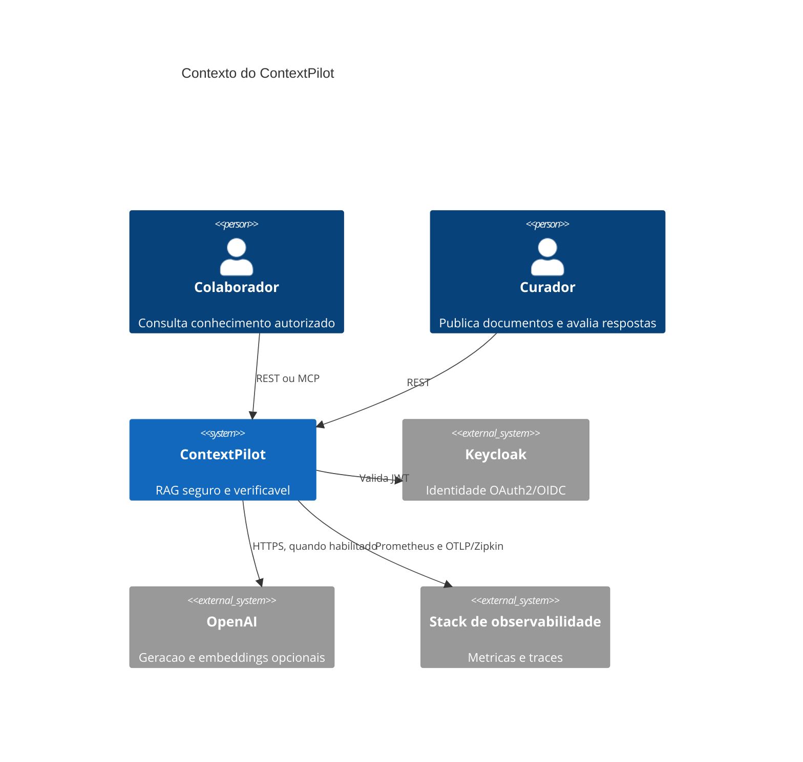
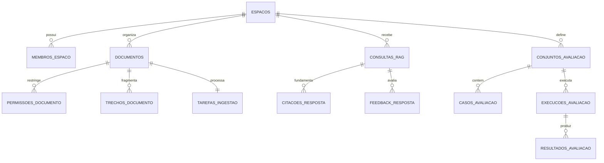

# Arquitetura do ContextPilot

## Contexto

O ContextPilot organiza conhecimento privado em espacos. Membros possuem um papel no espaco, mas documentos restritos exigem permissao propria. Consultas geram respostas somente a partir dos trechos acessiveis ao usuario autenticado.

## Modulos

| Pacote | Responsabilidade |
|---|---|
| `workspace` | espacos, membros, papeis e verificacao de acesso |
| `document` | upload, deduplicacao, ACL, extracao, fila e fragmentacao |
| `retrieval` | embeddings e busca hibrida autorizada |
| `answer` | geracao, validacao de citacoes, historico e feedback |
| `evaluation` | conjuntos, casos, execucoes e pontuacoes |
| `mcp` | ferramentas MCP autenticadas e somente de consulta |
| `audit` | trilha imutavel das operacoes relevantes |
| `configuration` | seguranca, OpenAPI, OpenAI e configuracoes transversais |

## Modelo de dados

## Busca hibrida

A consulta combina 70% de similaridade cosseno e 30% de relevancia `tsvector` em portugues. O CTE inicial seleciona somente trechos de documentos prontos e autorizados. Assim, um documento proibido nunca disputa o ranking nem influencia a existencia de uma resposta.

## Consistencia

- upload de documento e criacao da tarefa pertencem a uma transacao;
- cada hash SHA-256 aparece uma unica vez por espaco;
- trabalhadores reivindicam tarefas atomicamente com `FOR UPDATE SKIP LOCKED`;
- substituicao de trechos e conclusao da tarefa pertencem a uma transacao;
- respostas e suas citacoes sao gravadas juntas;
- feedback e permissao usam `UPSERT` para repeticao segura.

## Escala

O primeiro limite esperado e a geracao externa, nao o banco. A fila pode ganhar mais replicas da aplicacao sem duplicar uma tarefa. Para volumes muito maiores, os proximos passos naturais sao armazenamento de objetos, particionamento por espaco, reindexacao em segundo plano e limites de uso por locatario.
