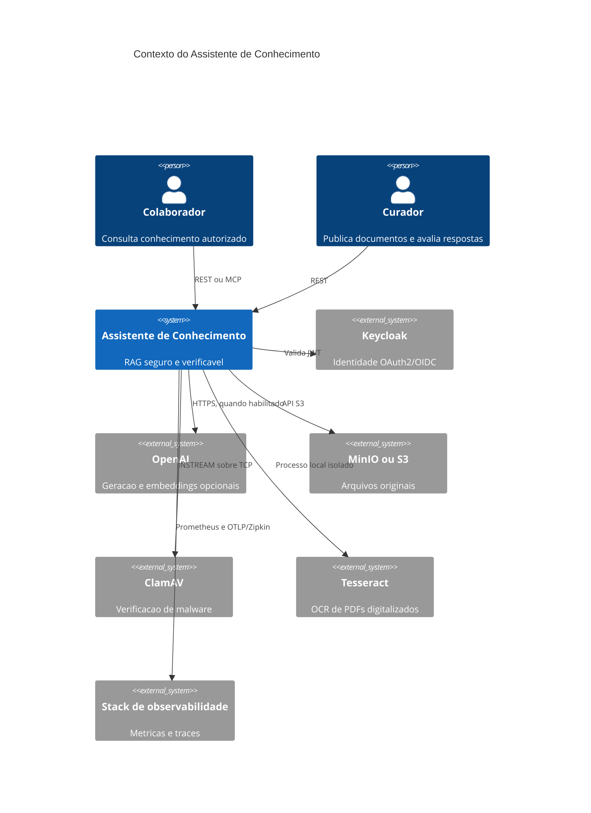
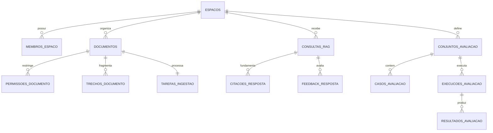

# Arquitetura do Assistente de Conhecimento

## Contexto

O Assistente de Conhecimento organiza conhecimento privado em espacos. Membros possuem um papel no espaco, mas documentos restritos exigem permissao propria. Consultas geram respostas somente a partir dos trechos acessiveis ao usuario autenticado.

## Modulos

| Pacote | Responsabilidade |
|---|---|
| `workspace` | espacos, membros, papeis e verificacao de acesso |
| `document` | upload, antivirus, S3, OCR, deduplicacao, ACL, fila e fragmentacao |
| `retrieval` | embeddings e busca hibrida autorizada |
| `answer` | geracao, validacao de citacoes, historico e feedback |
| `evaluation` | conjuntos, casos, execucoes e pontuacoes |
| `mcp` | ferramentas MCP autenticadas e somente de consulta |
| `audit` | trilha imutavel das operacoes relevantes |
| `configuration` | seguranca, OpenAPI, OpenAI e configuracoes transversais |

## Modelo de dados

## Busca hibrida

A consulta combina 70% de similaridade cosseno e 30% de relevancia `tsvector` em portugues. O CTE inicial seleciona somente trechos de documentos prontos e autorizados. Assim, um documento proibido nunca disputa o ranking nem influencia a existencia de uma resposta.

## Consistencia

- o ClamAV aprova o arquivo antes de qualquer persistencia;
- o objeto e gravado antes do registro; um rollback remove o objeto por compensacao;
- registro do documento e criacao da tarefa pertencem a uma transacao;
- cada hash SHA-256 aparece uma unica vez por espaco;
- documentos anteriores a V2 continuam legiveis em `BYTEA`; novos documentos usam `S3`;
- trabalhadores reivindicam tarefas atomicamente com `FOR UPDATE SKIP LOCKED`;
- substituicao de trechos e conclusao da tarefa pertencem a uma transacao;
- respostas e suas citacoes sao gravadas juntas;
- feedback e permissao usam `UPSERT` para repeticao segura.

## Ingestao segura

1. A API valida limite, extensao, assinatura PDF e UTF-8 aplicavel.
2. O ClamAV recebe o conteudo pelo protocolo `INSTREAM`; falha ou indisponibilidade rejeita o upload.
3. O SHA-256 identifica duplicatas e acompanha o objeto como metadado.
4. O arquivo limpo e gravado no bucket privado por uma chave sem nome fornecido pelo cliente.
5. A fila extrai texto nativo. Em PDF sem camada textual, renderiza ate 20 paginas e executa Tesseract com prazo por pagina.
6. Apenas texto suficiente segue para fragmentacao, embeddings e estado `PRONTO`.

## Escala

O primeiro limite esperado e a geracao externa, nao o banco. A fila pode ganhar mais replicas da aplicacao sem duplicar uma tarefa. Os arquivos ja estao fora do PostgreSQL, permitindo escalar o banco e o armazenamento separadamente. Para volumes muito maiores, os proximos passos naturais sao particionamento por espaco, workers dedicados de OCR, reindexacao em segundo plano e cotas por locatario.
